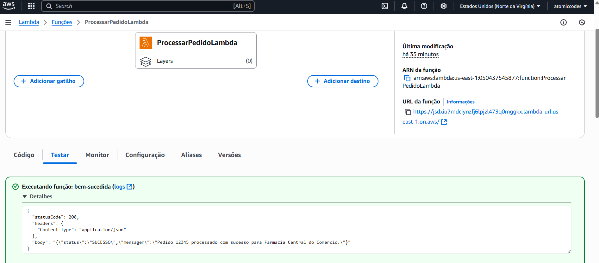

# 🏥 Dio Farmaceutica - AWS Lambda Java

<p align="center">
  
  
  
  
  
  
</p>

<div align="center">
  <b>🇧🇷 Português | <a href="#english-version">🇺🇸 English below</a></b>
</div>

---

## 📑 Sumário | Table of Contents
- [📊 Relatório | Report](#relatório--report)
- [⚙️ Tecnologias | Technologies](#tecnologias--technologies)
- [📁 Estrutura do Projeto | Project Structure](#estrutura-do-projeto--project-structure)
- [🚀 Instalação e Execução | Setup & Run](#instalação-e-execução--setup--run)
- [🔧 Como Usar | How to Use](#como-usar--how-to-use)
- [💡 Exemplos de Uso | Usage Examples](#exemplos-de-uso--usage-examples)
- [📎 Anexos | Attachments](#anexos--attachments)
  - [💻 Código do Projeto | Project Code](#-código-do-projeto--project-code)
  - [📸 Screenshot do Projeto | Project Screenshot](#-screenshot-do-projeto--project-screenshot)
- [👨‍💻 Autor | Author](#autor--author)

---

## 📊 Relatório | Report

**PT-BR:**
RELATÓRIO DE IMPLEMENTAÇÃO DE SERVIÇOS AWS
Data: 30/07/2025
Empresa: Dio Farmaceutica
Responsável: Rodolfo Marques Ferreira de Abreu – Desenvolvedor de Software - Java

### 📋 Introdução
Este relatório apresenta o processo de implementação de soluções baseadas em serviços da Amazon Web Services (AWS) na empresa Dio Farmaceutica, uma indústria farmacêutica com foco em produção e distribuição para clientes B2B. O objetivo principal do projeto foi reduzir custos operacionais imediatos através da adoção de três serviços estratégicos da AWS, otimizando a infraestrutura atual e ganhando escalabilidade, segurança e disponibilidade.

### 🎯 Descrição do Projeto
O projeto foi estruturado em três etapas, cada uma com foco em uma área crítica para a operação da empresa: armazenamento, análise de dados e hospedagem de sistemas. Abaixo estão detalhadas as etapas e os serviços utilizados.

### 🗄️ Etapa 1: Amazon S3 (Simple Storage Service)
**Foco da ferramenta:** Armazenamento de documentos regulatórios, relatórios de produção e arquivos de distribuição.

Descrição de caso de uso:
A empresa armazenava arquivos localmente em servidores físicos, o que demandava alto custo de manutenção e apresentava risco de perda de dados. Com o Amazon S3, todo o acervo foi migrado para buckets seguros e com versionamento ativado. Além disso, foi ativado o ciclo de vida automático para migração de dados antigos para classes de menor custo (S3 Glacier), gerando economia de até 60% em storage.

### 🗃️ Etapa 2: Amazon RDS (Relational Database Service)
**Foco da ferramenta:** Migração do banco de dados ERP para a nuvem.

Descrição de caso de uso:
O ERP utilizado na fábrica e na distribuição dependia de um banco de dados local com alta manutenção e baixo desempenho. Com a migração para o Amazon RDS (MySQL), foi possível garantir alta disponibilidade, backups automatizados, escalabilidade sob demanda e eliminar a necessidade de gerenciamento de hardware. A redução de custo estimada com manutenção e downtime foi de 40%.

### ⚡ Etapa 3: AWS Lambda + API Gateway
**Foco da ferramenta:** Automatização de pedidos e notificações para distribuidores.

Descrição de caso de uso:
Anteriormente, o envio de pedidos de distribuição era feito por processos manuais e scripts locais. Com o uso do AWS Lambda, criamos funções serverless para processar eventos de novos pedidos. O Amazon API Gateway foi utilizado para expor essas funções como uma API segura que pode ser acessada pelos distribuidores em tempo real. Essa solução eliminou servidores intermediários, acelerou o processamento em 70% e gerou economia direta com infraestrutura.

### ✅ Conclusão
A implementação dos serviços Amazon S3, Amazon RDS e AWS Lambda com API Gateway resultou em redução significativa de custos, aumento da resiliência, segurança e agilidade operacional. A Dio Farmaceutica passou a operar com maior eficiência em seu setor de produção e distribuição farmacêutica, ganhando vantagem competitiva.

### 🔮 Recomendações Futuras
Recomenda-se a continuidade da adoção de serviços AWS, especialmente para áreas como machine learning (previsão de demanda), segurança com AWS WAF e expansão de APIs para novos parceiros.

**EN:**
AWS SERVICES IMPLEMENTATION REPORT
Date: 07/30/2025
Company: Dio Farmaceutica
Responsible: Rodolfo Marques Ferreira de Abreu – Software Developer - Java

### 📋 Introduction
This report presents the implementation process of solutions based on Amazon Web Services (AWS) at Dio Farmaceutica, a pharmaceutical industry focused on production and distribution for B2B clients. The main objective of the project was to reduce immediate operational costs through the adoption of three strategic AWS services, optimizing the current infrastructure and gaining scalability, security, and availability.

### 🎯 Project Description
The project was structured in three stages, each focusing on a critical area for the company's operation: storage, data analysis, and system hosting. Below are detailed the stages and services used.

### 🗄️ Stage 1: Amazon S3 (Simple Storage Service)
**Tool focus:** Storage of regulatory documents, production reports, and distribution files.

Use case description:
The company stored files locally on physical servers, which required high maintenance costs and presented data loss risks. With Amazon S3, the entire archive was migrated to secure buckets with versioning enabled. Additionally, automatic lifecycle was activated for migrating old data to lower-cost classes (S3 Glacier), generating up to 60% savings in storage.

### 🗃️ Stage 2: Amazon RDS (Relational Database Service)
**Tool focus:** Migration of ERP database to the cloud.

Use case description:
The ERP used in the factory and distribution depended on a local database with high maintenance and low performance. With the migration to Amazon RDS (MySQL), it was possible to ensure high availability, automated backups, on-demand scalability, and eliminate the need for hardware management. The estimated cost reduction with maintenance and downtime was 40%.

### ⚡ Stage 3: AWS Lambda + API Gateway
**Tool focus:** Automation of orders and notifications for distributors.

Use case description:
Previously, distribution order processing was done through manual processes and local scripts. Using AWS Lambda, we created serverless functions to process new order events. Amazon API Gateway was used to expose these functions as a secure API that can be accessed by distributors in real-time. This solution eliminated intermediate servers, accelerated processing by 70%, and generated direct infrastructure savings.

### ✅ Conclusion
The implementation of Amazon S3, Amazon RDS, and AWS Lambda with API Gateway services resulted in significant cost reduction, increased resilience, security, and operational agility. Dio Farmaceutica now operates with greater efficiency in its pharmaceutical production and distribution sector, gaining competitive advantage.

### 🔮 Future Recommendations
It is recommended to continue the adoption of AWS services, especially for areas such as machine learning (demand forecasting), security with AWS WAF, and API expansion for new partners.

---

## ⚙️ Tecnologias | Technologies

- **Java 11** - Linguagem de programação principal
- **AWS Lambda** - Computação serverless
- **API Gateway** - Gerenciamento de APIs
- **Maven** - Gerenciamento de dependências
- **Jackson** - Serialização/deserialização JSON
- **AWS Lambda Java Core** - Framework para AWS Lambda

---

## 📁 Estrutura do Projeto | Project Structure

```
dio-aws-farmaceutica/
├── lambda-pedido-java/
│   ├── src/main/java/com/dio/farmaceutica/
│   │   ├── PedidoHandler.java      # Handler principal da Lambda
│   │   ├── PedidoRequest.java      # Modelo de requisição
│   │   └── PedidoResponse.java     # Modelo de resposta
│   ├── pom.xml                     # Configuração Maven
│   └── target/                     # Artefatos compilados
└── README.md
```

---

## 🚀 Instalação e Execução | Setup & Run

### 📋 Pré-requisitos | Prerequisites

- Java 11 ou superior
- Maven 3.6+
- AWS CLI configurado
- Conta AWS com permissões para Lambda e API Gateway

### 🔨 Compilação | Build

```bash
cd lambda-pedido-java
mvn clean package
```

### ☁️ Deploy na AWS | AWS Deployment

```bash
# Criar função Lambda
aws lambda create-function \
  --function-name dio-farmaceutica-pedido \
  --runtime java11 \
  --handler com.dio.farmaceutica.PedidoHandler::handleRequest \
  --zip-file fileb://target/lambda-pedido-1.0.jar \
  --role arn:aws:iam::YOUR_ACCOUNT:role/lambda-execution-role

# Configurar API Gateway
aws apigateway create-rest-api \
  --name "Dio Farmaceutica API" \
  --description "API para processamento de pedidos farmacêuticos"
```

---

## 🔧 Como Usar | How to Use

### 🌐 Endpoint da API | API Endpoint

```
POST https://YOUR_API_ID.execute-api.REGION.amazonaws.com/prod/pedido
```

### 📋 Headers | Headers

```
Content-Type: application/json
```

---

## 💡 Exemplos de Uso | Usage Examples

### 📤 Requisição de Exemplo | Sample Request

```json
{
  "pedidoId": "PED-2024-001",
  "cliente": "Farmácia Central do Comércio",
  "produto": "Dipirona Monoidratada 500mg/ml",
  "quantidade": 100
}
```

### ✅ Resposta de Sucesso | Success Response

```json
{
  "status": "SUCESSO",
  "mensagem": "Pedido PED-2024-001 processado com sucesso para Farmácia Central do Comércio."
}
```

### ❌ Resposta de Erro | Error Response

```json
{
  "status": "ERRO",
  "mensagem": "Pedido inválido."
}
```

---

## 📎 Anexos | Attachments

### 💻 Código do Projeto | Project Code

#### PedidoHandler.java
```java
package com.dio.farmaceutica;

import java.util.Map;
import com.amazonaws.services.lambda.runtime.Context;
import com.amazonaws.services.lambda.runtime.RequestHandler;
import com.amazonaws.services.lambda.runtime.events.APIGatewayProxyRequestEvent;
import com.amazonaws.services.lambda.runtime.events.APIGatewayProxyResponseEvent;
import com.fasterxml.jackson.databind.ObjectMapper;

public class PedidoHandler implements RequestHandler<APIGatewayProxyRequestEvent, APIGatewayProxyResponseEvent> {
    private final ObjectMapper mapper = new ObjectMapper();
    
    @Override
    public APIGatewayProxyResponseEvent handleRequest(APIGatewayProxyRequestEvent input, Context context) {
        try {
            PedidoRequest pedido = mapper.readValue(input.getBody(), PedidoRequest.class);
            if (pedido == null || pedido.getPedidoId() == null) {
                return new APIGatewayProxyResponseEvent()
                        .withStatusCode(400)
                        .withBody("{\"status\":\"ERRO\",\"mensagem\":\"Pedido inválido.\"}");
            }

            context.getLogger().log("Processando pedido: " + pedido.getPedidoId());

            String msg = String.format("Pedido %s processado com sucesso para %s.",
                                    pedido.getPedidoId(), pedido.getCliente());

            PedidoResponse response = new PedidoResponse("SUCESSO", msg);
            String responseBody = mapper.writeValueAsString(response);

            return new APIGatewayProxyResponseEvent()
                    .withStatusCode(200)
                    .withHeaders(Map.of("Content-Type", "application/json"))
                    .withBody(responseBody);

        } catch (Exception e) {
            context.getLogger().log("Erro ao processar o pedido: " + e.getMessage());
            return new APIGatewayProxyResponseEvent()
                    .withStatusCode(500)
                    .withBody("{\"status\":\"ERRO\",\"mensagem\":\"Erro interno ao processar o pedido.\"}");
        }
    }
}
```

#### PedidoRequest.java
```java
package com.dio.farmaceutica;

public class PedidoRequest {
    private String pedidoId;
    private String cliente;
    private String produto;
    private int quantidade;

    public String getPedidoId() { return pedidoId; }
    public void setPedidoId(String pedidoId) { this.pedidoId = pedidoId; }
    public String getCliente() { return cliente; }
    public void setCliente(String cliente) { this.cliente = cliente; }
    public String getProduto() { return produto; }
    public void setProduto(String produto) { this.produto = produto; }
    public int getQuantidade() { return quantidade; }
    public void setQuantidade(int quantidade) { this.quantidade = quantidade; }
}
```

#### PedidoResponse.java
```java
package com.dio.farmaceutica;

public class PedidoResponse {
    private String status;
    private String mensagem;

    public PedidoResponse(String status, String mensagem) {
        this.status = status;
        this.mensagem = mensagem;
    }

    public String getStatus() { return status; }
    public void setStatus(String status) { this.status = status; }
    public String getMensagem() { return mensagem; }
    public void setMensagem(String mensagem) { this.mensagem = mensagem; }
}
```

#### pom.xml
```xml
<project xmlns="http://maven.apache.org/POM/4.0.0" xmlns:xsi="http://www.w3.org/2001/XMLSchema-instance"
         xsi:schemaLocation="http://maven.apache.org/POM/4.0.0 http://maven.apache.org/xsd/maven-4.0.0.xsd">
  <modelVersion>4.0.0</modelVersion>
  <groupId>com.dio.farmaceutica</groupId>
  <artifactId>lambda-pedido</artifactId>
  <version>1.0</version>
  <dependencies>
    <dependency>
      <groupId>com.amazonaws</groupId>
      <artifactId>aws-lambda-java-core</artifactId>
      <version>1.2.3</version>
    </dependency>
    <dependency>
      <groupId>com.fasterxml.jackson.core</groupId>
      <artifactId>jackson-databind</artifactId>
      <version>2.13.3</version>
    </dependency>
    <dependency>
      <groupId>com.amazonaws</groupId>
      <artifactId>aws-lambda-java-events</artifactId>
      <version>3.11.0</version>
    </dependency>
  </dependencies>
  <build>
    <plugins>
      <plugin>
        <groupId>org.apache.maven.plugins</groupId>
        <artifactId>maven-shade-plugin</artifactId>
        <version>3.2.4</version>
        <executions>
          <execution>
            <phase>package</phase>
            <goals>
              <goal>shade</goal>
            </goals>
            <configuration>
              <createDependencyReducedPom>false</createDependencyReducedPom>
              <transformers>
                <transformer implementation="org.apache.maven.plugins.shade.resource.ManifestResourceTransformer">
                  <mainClass>com.dio.farmaceutica.PedidoHandler</mainClass>
                </transformer>
              </transformers>
            </configuration>
          </execution>
        </executions>
      </plugin>
    </plugins>
  </build>
</project>
```

### 🧪 Teste com cURL | cURL Test

```bash
curl -X POST https://YOUR_API_ID.execute-api.REGION.amazonaws.com/prod/pedido \
  -H "Content-Type: application/json" \
  -d '{
    "pedidoId": "PED-2024-001",
    "cliente": "Farmácia Central do Comércio",
    "produto": "Dipirona Monoidratada 500mg/ml",
    "quantidade": 100
  }'
```

### 📸 Screenshot do Projeto | Project Screenshot



**PT-BR:** *Screenshot mostrando a interface ou estrutura do projeto AWS Lambda para processamento de pedidos farmacêuticos.*

**EN:** *Screenshot showing the interface or structure of the AWS Lambda project for pharmaceutical order processing.*

---


## 👨‍💻 Autor | Author

**PT-BR:**

<div align="center">

**Rodolfo M. F. Abreu**  
Desenvolvedor de software apaixonado por tecnologia, aprendizado contínuo e boas práticas de programação. Sempre em busca de novos desafios e oportunidades para colaborar em projetos inovadores.

[](https://github.com/salamandery)
[](https://linkedin.com/in/rodolfo-marques-ferreira-de-abreu/)

Sinta-se à vontade para entrar em contato para dúvidas, sugestões ou colaborações!

</div>

**EN:**

<div align="center">

**Rodolfo M. F. Abreu**  
Software developer passionate about technology, continuous learning, and best programming practices. Always looking for new challenges and opportunities to collaborate on innovative projects.

[](https://github.com/salamandery)
[](https://linkedin.com/in/rodolfo-marques-ferreira-de-abreu/)

Feel free to get in touch for questions, suggestions, or collaborations!

</div>

---

<div align="center">
  <b>Feito com 💙 para estudos de AWS Lambda, Java e arquitetura serverless.<br/>
  Made with 💙 for AWS Lambda, Java and serverless architecture studies.</b>
</div>

---

<div align="center" id="english-version">
  <b>🇺🇸 English version above | <a href="#top">🇧🇷 Versão em português acima</a></b>
</div>